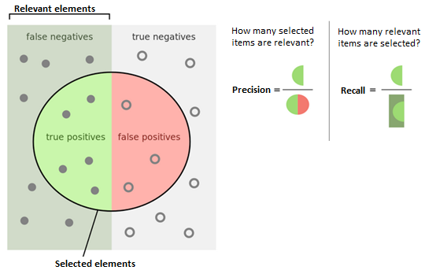

# LUIS Chatbot - Tech Support Digital Assistant
<!-- forge.header -->
[![CloudForge Console][console_shield]][console_url] [![Open PRs][pr_shield]][pr_url]

| Environment   | Type          | Status        | Days Since Last Deployment |
| ------------- | ------------- | ------------- | -------------------------- |
| Microsoft LUIS |              | creating new models |                      |
<!-- /forge.header -->

<!-- Add your content here -->
## Our Progress
- :heavy_check_mark: Retrieved Utterances from Power BI

- :heavy_check_mark: Added utterances to batch files (600)

- :heavy_check_mark: Created pipeline on adding utterances through Excel

- :heavy_check_mark: Created JavaScript script that adds and trains new utterances into model

- :heavy_check_mark: Created pipeline for adding entities and its sub-entities to utterances through Excel

- :x: Create different models with different intents to test

- :heavy_check_mark: Framework for testing and analyzing/improving prediction score and/or accuracy

- :heavy_check_mark: Framework for training completed data using JS script

## Pipeline Visual (Coming Soon)
TBD

## How It's Done
Main framework:

**Testing** team will:

* Test random batch files with utterances to see how model behaves.
* Analyze results and pinpoint bottlenecks in data (i.e. wrong labeled entity, low prediction score, etc.).
* Communicate those results with training team to improve training data.
* Repeat steps 1 - 3 with different batch files and different models.

**Training** team will:

* Use Excel pipeline to structure JSON files with correct utterances and its respective entities/sub-entities.
* Target specific utterances and entities based on model behavior.
* Use JavaScript automation script to send and train the data into LUIS endpoint.
* Repeat steps 1 - 3 with different training sets and different models.


## JavaScript Automation Process
Uses the `request` API to grab utterances and send to LUIS bot for training.

Uses `POST` and `GET` methods to supply training data into the LUIS endpoint.

The `train` function performs the training process asynchronously for a smooth process.

```
const train = async (verb) => {

    const options = {
        uri: addTrainURI,
        method: verb,
        headers: {
            'Ocp-Apim-Subscription-Key': LUIS_authoringKey
        },
        json: true,
        body: null // The body can be empty for a training request
    };

    const response = await request(options)
    console.log("train " + verb + ":\n" + JSON.stringify(response, null, 2));
}
```

## How to use
To use the `transferDataScript.js` file, make sure to connect to the node environment using

`npm init`

or

copying `C:\Windows\System32\cmd.exe /k "C:\Program Files\nodejs\nodevars.bat"` into the command prompt.

* Add the utterance data into the `utterances` variable.
* Adjust all endpoint URLS --> `LUIS_appId`, `LUIS_authoringKey`, `LUIS_endpoint`, and `LUIS_versionId` to connect to the correct bot.

Save the file and on the CLI, run `node transferDataScript.js` and expect to see "done" OR a 400 error.

**Alternative method of sending/training utterance data TBA**

## LUIS Chatbot Metrics

### What is an f-score?
In simple terms, an f-score is a measure of a test's accuracy. According to wikipedia.com, it is calculated from the precision and recall of the test.



**Precision** is:

`(number of true positives) / (number of true AND false positives)`

**Recall** is:

`(number of true positives) / (number of all samples that SHOULD have been identified as positive)`

### Use Case
The f-score has helped us gauge at the digital assistant's intelligence. It gives us a rough number of how many utterances it's **correctly** labeling.

In our case, we calculated the average f-scores for all of the performances in each intent.

`fScore_Avg = (total f-score for each intent) / (all 11 intents)`

## Our Results (subject to change)

[insert f-score average graph here]

[insert correct/incorrect/unclear prediction graph here per version]


<!-- forge.links -->

[console_url]: https://console.forge.lmig.com/artifact/d96e3084-e266-4d2f-9345-64c3c780f937 "Console URL"
[console_shield]: https://shields.lmig.com/static.svg?label=CloudForge%20Console&message=haae_luis&colorA=1A1446&colorB=78E1E1
[pr_url]: https://git.forge.lmig.com/projects/HAAE/repos/haae-luis/pull-requests
[pr_shield]: https://shields.lmig.com/bitbucket/pull-requests/haae/haae-luis/open.svg

<!-- /forge.links -->
